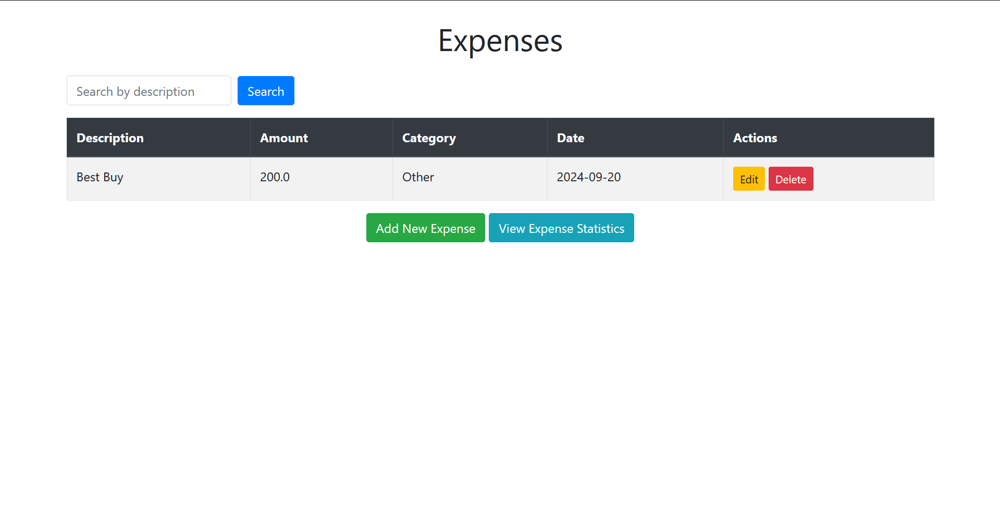
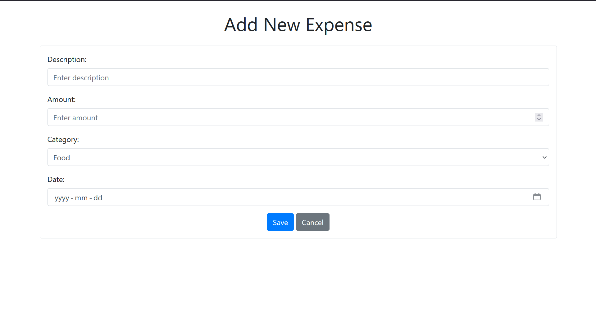
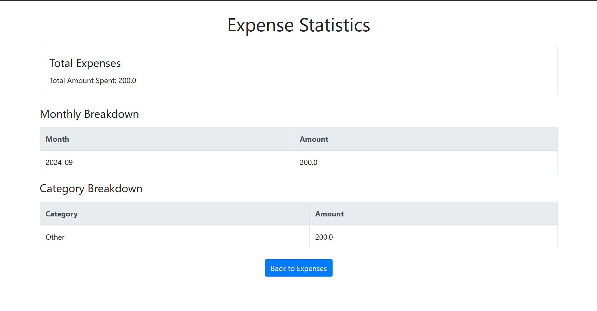

# Expense Tracker

## A simple Spring Boot application for managing personal expenses

## Features

- **Add Expenses**: Create a new expense by specifying a description, amount, category, and date.
- **Edit Expenses**: Edit existing expenses, allowing users to update the description, amount, category, and date.
- **View All Expenses with Pagination**: View all stored expenses in a paginated format, making it easy to navigate through large numbers of expenses.
- **Search Expenses**: Search for specific expenses by description, making it easier to filter and find relevant expenses.
- **View Statistics**: Display statistics such as total expenses, category-wise expenses, and monthly breakdowns.
- **Delete Expenses**: Remove an expense by ID.

## Screenshots

### 1. Expense List Page

This page shows all your expenses in a paginated view. You can edit or delete expenses from here, or add new ones.



### 2. Add/Edit Expense Page

You can add a new expense or edit an existing one through this form. The form allows you to specify the description, amount, category, and date of the expense.



### 3. Expense Statistics Page

This page displays helpful statistics, such as total expenses, monthly breakdown, and category-wise breakdown.



## Technologies Used

- **Java 11+**
- **Spring Boot**: For building the application and REST API.
- **Spring Data JPA**: To handle database operations.
- **H2 Database**: In-memory database for simplicity and testing.
- **Thymeleaf**: Server-side templating engine used for rendering views.
- **Bootstrap 4.5**: For modern and responsive user interface styling.
- **Maven**: For dependency management and building the project.

## Getting Started

### Prerequisites

- **Java 11** or later installed on your machine.
- **Maven** installed (optional if you're using an IDE with built-in Maven support).
- **Git** installed for version control (to clone and manage the project).
- **Postman** or **curl** (optional, for testing the API endpoints).

### Installation

1. **Clone the repository**:

    ```bash
    git clone https://github.com/your-username/expense-tracker.git
    cd expense-tracker
    ```

2. **Build the project** (if using Maven):

    ```bash
    mvn clean install
    ```

3. **Run the application**:

    ```bash
    mvn spring-boot:run
    ```

    Alternatively, if you are using an IDE like IntelliJ or Eclipse, you can run the `ExpenseTrackerApplication.java` file directly.

4. **Access the application**:

    - Navigate to `http://localhost:8080` in your browser.

    - From here, you can interact with the expense tracker application via the user interface.

## User Interface Features

- **Bootstrap UI**: The application uses Bootstrap 4.5 for a modern, responsive design, ensuring a consistent and user-friendly interface across devices.
- **Pagination**: Expenses are displayed in a paginated format, allowing users to navigate through multiple pages of records efficiently.
- **Search Functionality**: Users can search for expenses by description, providing a quick way to filter relevant expenses.
- **Expense Statistics**: Users can view detailed statistics including:
  - **Total Expenses**: The total amount spent.
  - **Monthly Breakdown**: Expenses grouped by month.
  - **Category Breakdown**: Expenses grouped by category.

## API Endpoints

### 1. Add a New Expense

- **URL**: `/expenses`
- **Method**: `POST`
- **Request Body**:

    ```json
    {
        "description": "Groceries",
        "amount": 50.0,
        "category": "Food",
        "date": "2024-09-20"
    }
    ```

- **Response**: Returns the created expense object.

### 2. Get All Expenses (Paginated)

- **URL**: `/expenses`
- **Method**: `GET`
- **Response**: Returns a paginated list of all expenses.

### 3. Search for Expenses

- **URL**: `/expenses/search`
- **Method**: `GET`
- **Query Parameter**: `query` (used to search by description)
- **Response**: Returns a list of matching expenses.

### 4. View Expense Statistics

- **URL**: `/expenses/stats`
- **Method**: `GET`
- **Response**: Returns statistics including total expenses, monthly breakdown, and category-wise expenses.

### 5. Get Expense by ID

- **URL**: `/expenses/{id}`
- **Method**: `GET`
- **Response**: Returns the expense with the specified ID or a `404 Not Found` if the expense doesn't exist.

### 6. Delete an Expense

- **URL**: `/expenses/delete/{id}`
- **Method**: `GET`
- **Response**: Deletes the expense with the specified ID. Returns `204 No Content` on success, or `404 Not Found` if the expense doesn't exist.

## H2 Database Console

To view the in-memory H2 database, visit the following URL after running the application:

- **URL**: `http://localhost:8080/h2-console`
- **JDBC URL**: `jdbc:h2:mem:testdb`
- **Username**: `sa`
- **Password**: `password`

Ensure the application is running, and then you can view or query the database using the H2 console.

## Project Structure

```bash
expense-tracker/
├── src/
│   ├── main/
│   │   ├── java/
│   │   │   └── com/example/expensetracker/
│   │   │       ├── Expense.java              # Expense entity class
│   │   │       ├── ExpenseRepository.java    # Repository interface for CRUD operations
│   │   │       ├── ExpenseService.java       # Service layer for business logic
│   │   │       ├── ExpenseController.java    # Controller for REST API and Thymeleaf templates
│   │   │       └── ExpenseTrackerApplication.java  # Main class to start the Spring Boot application
│   │   └── resources/
│   │       ├── templates/                    # Thymeleaf templates for UI rendering
│   │       │   ├── expense-list.html         # List of all expenses
│   │       │   ├── expense-form.html         # Form for creating/editing expenses
│   │       │   ├── expense-stats.html        # Expense statistics display
│   │       └── application.properties        # Database configuration (H2)
├── docs/                                     # Documentation folder for images/screenshots
│   └── screenshots/                          # Folder for screenshots
│       ├── expense-list.png                  # Screenshot of the expense list page
│       ├── expense-form.png                  # Screenshot of the expense form page
│       └── expense-stats.png                 # Screenshot of the statistics page
├── pom.xml                                    # Maven dependencies and build configuration
└── README.md                                  # Project documentation
```

## Configuration

### `application.properties`

Located in `src/main/resources/application.properties`. It contains configuration settings for the database and other Spring Boot properties.

```properties
# H2 Database configuration
spring.datasource.url=jdbc:h2:mem:testdb
spring.datasource.driverClassName=org.h2.Driver
spring.datasource.username=sa
spring.datasource.password=password
spring.h2.console.enabled=true
spring.jpa.hibernate.ddl-auto=update
```

## Contributing

1. Fork the repository.
2. Create a new branch (`git checkout -b feature/your-feature-name`).
3. Commit your changes (`git commit -m 'Add some feature'`).
4. Push to the branch (`git push origin feature/your-feature-name`).
5. Open a pull request.

## License

This project is licensed under the MIT License - see the [LICENSE](LICENSE) file for details.
